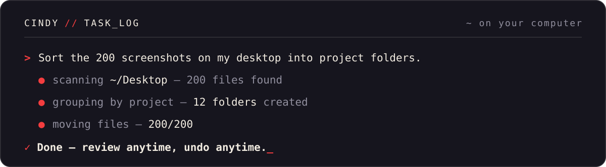

  

  🌐&nbsp;<b><a href="https://cindy.app">cindy.app</a></b> (International) · <b><a href="https://cindy.cn">cindy.cn</a></b>（中国大陆） &nbsp;|&nbsp; ⬇️&nbsp;<a href="https://cindy.app/#download">Download</a> &nbsp;|&nbsp; 🛠&nbsp;<a href="https://github.com/makecindy/cindy">Source code</a>

  

Cindy is an open-source, ready-to-use AI work platform — it gives everyone an AI assistant that understands the task, operates real tools, and keeps work moving until it is done. Built on leading agent harnesses such as **Claude Code** and **Codex**, it works with the official AI Gateway out of the box; you can also use your own keys, reuse the subscriptions you already pay for, self-host, and govern usage across a team.

Cindy 是一个开箱即用的开源 AI 工作平台，让每个人都拥有一个能理解任务、操作工具、推进工作直到完成的 AI 助理。它基于 Claude Code、Codex 等领先 Agent 能力，既能直接使用官方 AI Gateway，也能用你自己的 key、复用你已有的订阅，并支持自部署与团队治理。

  

## Repositories

| Repository | About |
|---|---|
| [cindy](https://github.com/makecindy/cindy) | Cindy desktop app & agent runtime · 桌面端与 agent runtime |
| [cindy-protocol](https://github.com/makecindy/cindy-protocol) | Client–server exchange protocol · 客户端与 Server 的数据交换协议 |
